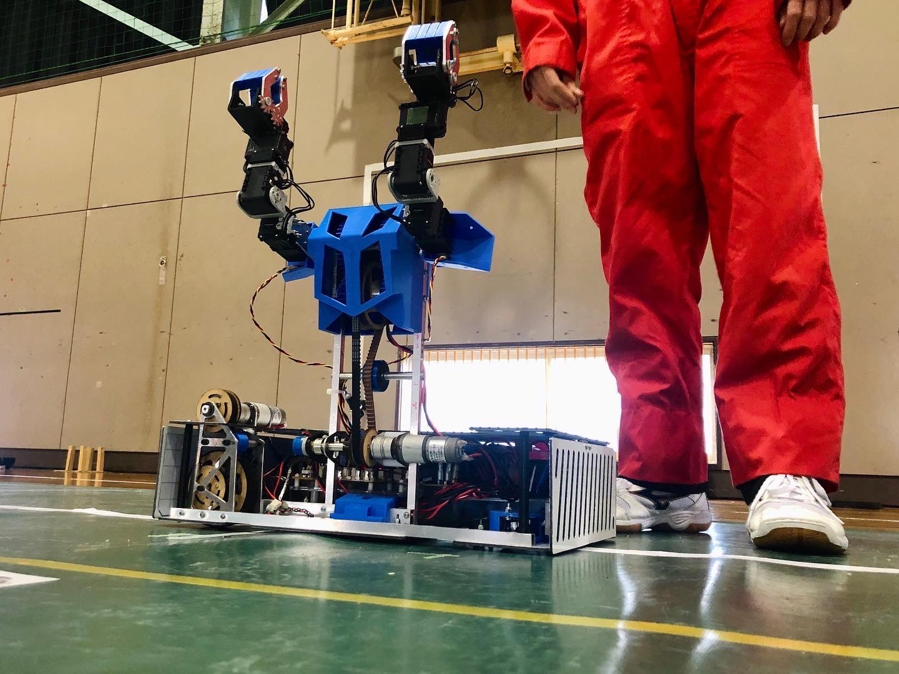

# 高専ロボコン2020: アルティメットちゃぶ台返し・とりゃーキング

## 1. 概要
**第33回 アイデア対決・全国高等専門学校ロボットコンテスト2020** （オンライン開催）に向け制作したロボット。
この年の競技で私は**回路設計およびアーム制御プログラム**を担当した。

* **チーム:** 北九州工業高等専門学校 Aチーム
* **大会期間:** 2020年6月26日～2020年11月1日
* **開発人数:** 8名 (設計・製作2名、回路・制御2名、競技補助4名)

## 2. 競技ルールと課題
**【テーマ：だれかをハッピーにするロボットを作ってキラリ輝くパフォーマンスを自慢しちゃおうコンテスト】**
**はぴ☆ロボ自慢**

本大会はコロナ禍の影響により、史上初のオンライン開催となった。
従来の対戦形式ではなく、各チームが自由にテーマを設定し、制限時間内にパフォーマンスを行う形式であった。

## 3. コンセプト・技術

### コンセプト：コロナ禍のストレスを吹き飛ばす「ちゃぶ台返し」
自粛生活の鬱憤を晴らすため、ロボットが豪快にちゃぶ台をひっくり返すパフォーマンスを考案した。単調にならないよう、以下のギミック（一部）を搭載した。
* **消毒:** コロナ禍であったため、手指消毒をしてからちゃぶ台に向かう
* **盤面返し:** オセロや将棋で考えた後、不利と悟ってひっくり返す
* **ヒヨコの乗ったちゃぶ台:** ヒヨコが乗っている為、倫理的にひっくり返すのをやめる
* **刀で斬る:** おもちゃの剣でオブジェクトを一刀両断する

### 技術的内容：ダイレクトティーチングの実装
短い開発期間で、多様で面白い動きを作るため、**ダイレクトティーチング機能**を自作実装した。

* **概要:** ロボットのアームを手で直接動かし、任意の位置データを記録・再生するシステム。
* **効果:** プログラムを書けないメンバーでも直感的にモーションを作成可能になり、演出のクオリティ向上と工数短縮を同時に実現した。

## 4. システム構成・技術詳細

### ハードウェア (Hardware)
* **CAD:** Eagle (回路設計)
* **MCU:** mbed (Nucleo)
* **アクチュエータ:**
    * アーム部: Dynamixel AX-12A × 8
    * 肩ピッチ軸: マブチ RS-385PH
* **移動機構:** 差動二輪駆動 (駆動輪×2 + キャスター×2)
* **電源:**
    * 駆動系: エネループ 12.0V (=1.2V * 10)
    * 制御系: モバイルバッテリー 5.0V

### ソフトウェア (Firmware)
* **開発環境:** PlatformIO / VSCode
* **言語:** C++
* **担当箇所:**
    * アーム制御クラスの設計
    * ダイレクトティーチングの実装
    * 統合制御

## 5. 大会結果・評価
* **大会映像URL:** https://www.youtube.com/live/jiNWSLm5MmE?si=9rgZbpHFRhxKeb0Y&t=14009
* **本田技研工業株式会社 特別賞 受賞** (九州沖縄地区大会)
* **評価点:**
    * トラブルも演出かと思う楽しさがあった。
    * 技術もさることながら見る人の気持ちをよく考えられている点が良かった。
    * 今後も人の気持ちを考える技術者になるように技術を磨いてほしい。とてもハッピーな気持ちになった。

## 6. ディレクトリ構成
* `Firmware/`: 制御プログラムコード (PlatformIO)
* `Hardware/`: 回路図データ (EAGLE / PDF)
* `Images/`: ロボットの写真

---
[ポートフォリオのトップに戻る](../README.md)
